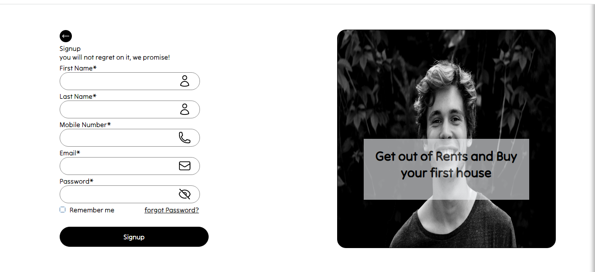
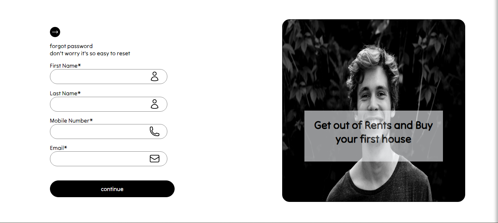
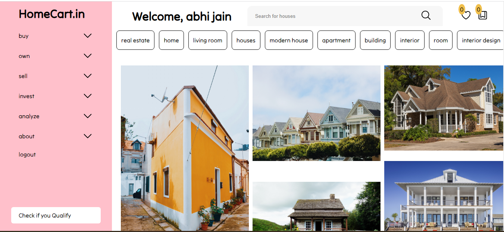
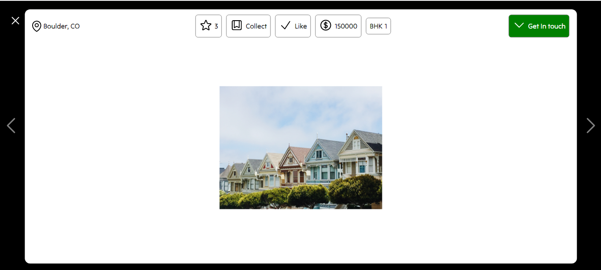

# Home LLC

it is an online marketplace to browse and buy homes online.

## wanna run locally

## follow these Steps
1. clone the repo.
2. install the packages
3. start the server locally by npm run start command.

that's it

## Snapshots

## Demo Videos
https://youtube.com/playlist?list=PLAVYszYopl6iOgRe5R-JwUYzsP0cglje7

This youtube playlist has 4 videos named as demo1, demo2, demo3, demo4
in demo1 and demo2 I have explained everything from signup/login to forgot/update password to home page/state management
while in demo3 and demo4 contains glimpse of web
